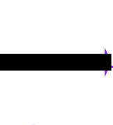

<p align="center">
  
</p>

<h1 align="center" style="margin-top: -10px">Auto Decimal</h1>
<div align="center" style="margin-bottom:10px">
  <a href="https://www.npmjs.com/package/unplugin-auto-decima">
    
  </a>
  <a href="https://www.npmjs.com/package/unplugin-auto-decima">
    
  </a>
</div>
⚡️ 支持 Vue、React、Vite、Typescript

## 功能
将代码中的加、减、乘、除运算自动转为 Decimal 方法，用于处理 Javascript 中运算所造成的精度问题

## 安装

插件依赖于 `decimal.js-light`，请一并进行安装

```bash
npm i -S decimal.js-light
npm i -D vite-plugin-auto-decimal
```

## 参数
```ts
AutoDecimal({
  /**
   * 字段串类型是否支持转换
   * 默认 true，仅将可以转换为数字的字符串进行运算，如果无法转换为一个数字的话，则跳过
   * false 时，包含字符串的计算表达式都将被忽略
   */
  supportString: true
})
```

## 用法
如果是 React 的话, 需要将 `AutoDecimal` 放在 React 前面。
```ts
// vite.config.ts
import AutoDecimal from 'vite-plugin-auto-decimal'
import React from '@vitejs/plugin-react'
export default defineConfig({
  plugins: [AutoDecimal(), React()],
})
```
vue 正常情况下, 不需要注意顺序,但是如果遇到某种问题的话, 也可以调整顺序试试（我还没遇到）。
```ts
// vite.config.ts
import AutoDecimal from 'vite-plugin-auto-decimal'

export default defineConfig({
  plugins: [AutoDecimal()],
})
```
到此已经配置完毕，以后就可以直接写加、减、乘、除来进行计算了。
```html
<!-- Composition -->
<template>
  <div>
    <div>本地{{ sum }}</div>
    <div>接口{{ result }}</div>
  </div>
</template>

<script setup lang="ts">
  import { ref } from 'vue'
  const sum = 0.1 + 0.2;
  console.log('sum => ', sum); // 0.3
  const result = ref(0)
  async function getData() {
    const response = await api()
    // response: { price: 0.07, quantity: 10 }
    result.value = response.price * response.quantity
    console.log('result.value => ', result.value); // 0.7
  }
</script>
```

```html
<!-- Options -->
<template>
  <!-- sum: 0.3 -->
  <div>{{ sum }}</div>
</template>
<script lang="ts">
  export default defineComponent({
    data() {
      return {
        sum: 0.1 + 0.2
      }
    }
  })
</script>
```

### 禁用转换
有的时候，有些计算是不需要转换的。那么要如何跳过某个计算表达式或者全部跳过呢？

- 添加相应的注释（只要注释中包含指定内容即可, `jsx` 中需要注意, 在表达式中可能需要使用 Javascript 注释）
- 添加 `ad-ignore` prop
- `supportString: true`时, 末尾拼接一个空字符串
- `supportString: false`时, 末尾拼接任意字符串

#### script
当你想跳过某个计算表达式，不需要转换时，可以使用 `next-ad-ignore` 注释:
```ts
// next-ad-ignore
const sum = 0.1 + 0.2
console.log('sum => ', sum) // 0.30000000000000004
// 注释在右侧
const sumStrDirection = 0.1 + 0.2 // next-ad-ignore
console.log('sumStrDirection => ', sumStrDirection) // '0.30000000000000004'
// 末尾拼接一个空字符串
...
const sumStr = 0.1 + 0.2 + ''
console.log('sumStr => ', sumStr) // '0.30000000000000004'
```

如果你想在某个作用域内，所有计算表达式都不进行转换的话，使用 `block-ad-ignore` 注释:
```ts
const sum = 0.1 + 0.2
console.log('sum => ', sum) // 0.3
const sumStr = 0.1 + 0.2 + ''
console.log('sumStr => ', sumStr) // '0.30000000000000004'
...
// block-ad-ignore
{
  const sum = 0.1 + 0.2
  console.log('sum => ', sum) // 0.30000000000000004
  const sum = 0.1 + 0.2
  console.log('sum => ', sum) // 0.30000000000000004
}

function sum() {
  const sum = 0.1 + 0.2
  console.log('sum => ', sum) // 0.3
  const sumStr = 0.1 + 0.2 + ''
  console.log('sum => ', sum) // '0.30000000000000004'
}
sum()

// block-ad-ignore
function sumFn() {
  const sum = 0.1 + 0.2
  console.log('sum => ', sum) // 0.30000000000000004
}
sumFn()
```

如果你想某个文件内的计算表达式都不进行转换的话，可以在文件顶部使用 `file-ad-ignore` 注释:
```ts
// file-ad-ignore
...
const sum = 0.1 + 0.2
console.log('sum => ', sum) // 0.30000000000000004
const sum2 = 0.1 + 0.2
console.log('sum2 => ', sum2) // 0.30000000000000004
```
#### template
如果只是想单独禁用 template 的话， 只需要在 template 标签添加 `ad-ignore` prop 即可。
```html
<!-- 在根 template 中添加 ad-ignore。这样的话，template 中所有的计算都不会转换 -->
<template ad-ignore>
    ...something
</template>
```

`ad-ignore` 只能影响在 `template` 中定义的计算表达式是否转换, 不会影响到 `script` 中定义的计算表达式。
```html
<template ad-ignore>
  <!-- title="0.30000000000000004" -->
  <div :title="0.1+0.2">
    <!-- ad-ignore 不会影响到在 script 中定义的变量 -->
    <!-- title="0.3" -->
    <div :title="num.toString()">
    </div>
  </div>
</template>
<script setup>
  const num = ref(0.1+0.2)
</script>
```

在 template 中, 也可以使用 `next-ad-ignore` 和 `block-ad-ignore`，同时也需要区分两种注释。

- `next-ad-ignore` 用于组件 `prop` 和各个参数, 但不包含插槽与子集
- `block-ad-ignore` 用于控制整个组件的所有属性包括插槽及子集

```html
<template>
  <div>
    <!-- next-ad-ignore title="0.30000000000000004" alt="getAlt(0.30000000000000004)" -->
    <div :title="0.1 + 0.2" :alt="getAlt(0.1 + 0.2)">
      <!-- 0.3 -->
      <div>
        {{ 0.1 + 0.2 }}
      </div>
    </div>
    <!-- block-ad-ignore title="0.30000000000000004" -->
    <div :title="0.1 + 0.2">
      <!-- 0.30000000000000004 -->
      <div>{{ 0.1 + 0.2 }}</div>
    </div>
    <!-- title="0.3" -->
    <div :title="0.1 + 0.2">
      <!-- next-ad-ignore 0.30000000000000004 -->
      {{ 0.1 + 0.2 }}
      <!-- block-ad-ignore title="0.30000000000000004" -->
      <div :title="0.1 + 0.2">
        <!-- 0.3 -->
        {{ 0.1 + 0.2 }}
      </div>
    </div>
  </div>
</template>
<script setup>
function getAlt(value) {
  // 0.30000000000000004
  console.log(value)
}
</script>
```

#### jsx
目前 `jsx` 中的注释做了简单的处理，所以与 `template` 中略有不同。
```tsx
import OtherComponent from '..'
render() {
  const list = Array.from({ length: 3 }, item => 0.1)
  return (<div>
    {/* next-ad-ignore 0.30000000000000004 */}
    <div>jsx comment: {0.1 + 0.2}</div>

    {/* 0.30000000000000004 */}
    <div>拼接空字符串: {0.1 + 0.2 + ''}</div>

    {/* 0.3 */}
    <div>正常输出: {0.1 + 0.2}</div>
    {
      /**
      * 和 template 的不同在这里
      * 和 template 的不同在这里
      * 和 template 的不同在这里
      *
      * 这里添加注释的话, 所有传递给组件的计算表达式都不会转换，包括插槽和子集
      * template 中，插槽和子集进行了区分，而 jsx 中没有区分
      * next-ad-ignore
      */
    }
    {/* 所有计算表达式均不会转换，所以 num=0.30000000000000004 */}
    <OtherComponent num={0.1 + 0.2} >
      {/* slot 0.30000000000000004 */}
      {0.1 + 0.2}
      {/* num=0.30000000000000004 */}
      <OtherComponent num={0.1 + 0.2}>
        {/* slot 0.30000000000000004 */}
        {0.1 + 0.2}
      </OtherComponent>
    </OtherComponent>
    {
      list.map(item => {
        {/* 这里要注意使用 Javascript 中的注释形式, 不能使用 jsx 中的注释形式 */}
        {/* 这里要注意使用 Javascript 中的注释形式, 不能使用 jsx 中的注释形式 */}
        {/* 这里要注意使用 Javascript 中的注释形式, 不能使用 jsx 中的注释形式 */}

        {/* 所以这种是不生效的 next-ad-ignore */}
        const sum = 0.1 + 0.2
        console.log('sum => ', sum) // 0.3
        // 这种是生效的 next-ad-ignore <div style="color: red;">0.30000000000000004</div>
        return <div style="color: red;">{item + 0.2}</div>
      })
    }
  </div>)
}
```
## License

[MIT](./LICENSE) License © 2024-PRESENT [很久以前](https://github.com/lx11573)
